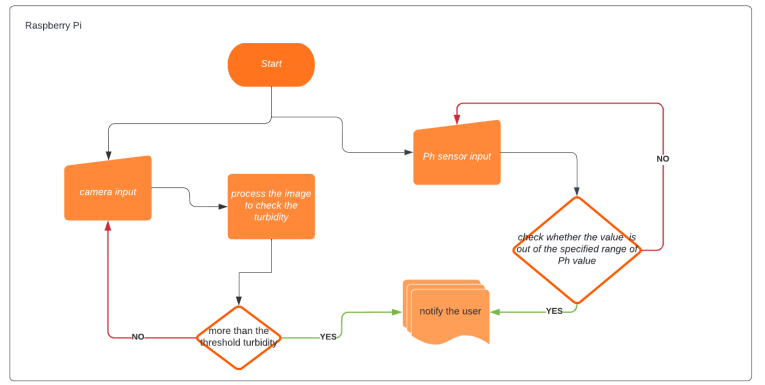
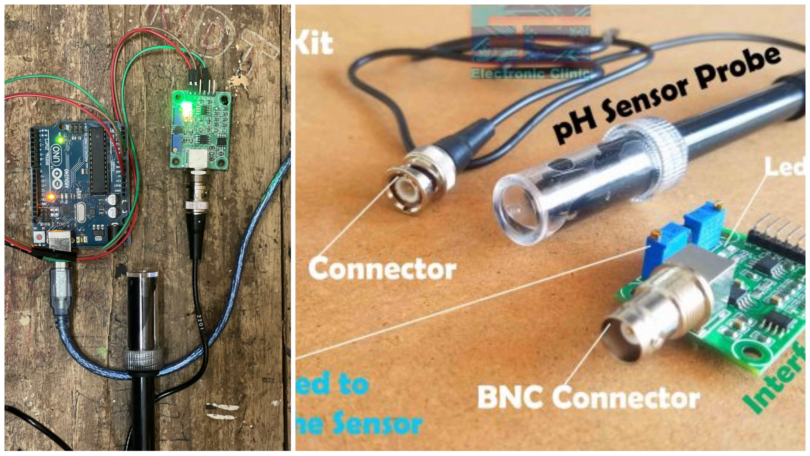
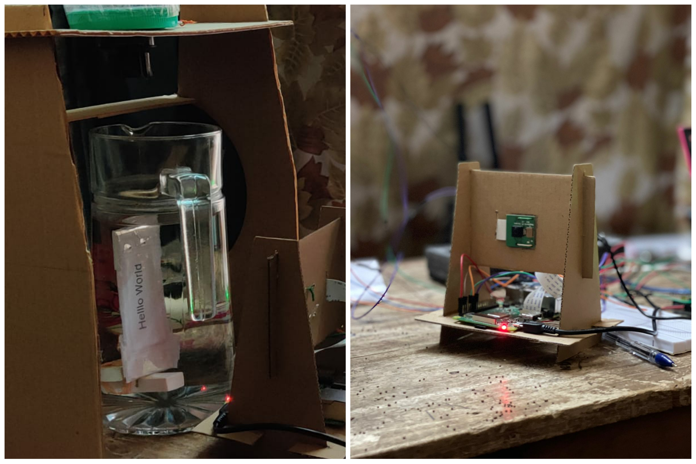
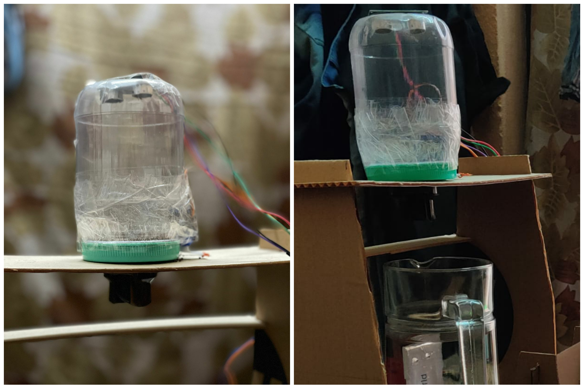

# Fish Tank Monitoring System


Fish and other aquatic animals need a balanced pH for survival of them. This pH value can make fish sick and  even kill them. Therefore, we are proposing a system for fish tanks which monitors the value of pH using the pH  sensor and alert the specific person using notification. There after we can add baking soda to raise the pH and add peat moss to lower the pH value. We also do check the turbidity of water using the camera and image  processing. In addition to that we propose an automated feeding system at regular intervals.

## Project Scope 
<p>This project will focus on developing a pH meter using an analog pH meter, conversion module and Arduino for pH monitoring. For turbidity monitoring, we use camera module and cover software parts.
This project will include, </p>

- PH monitoring system using Analog pH sensor, BNC connector which is connected to the raspberry pi 3 B+ and display the real time output to the LCD showing current pH value and the range of the suitable pH value. When the pH value changes out of the range the display will output a message saying that 
the pH out of range on the android app.

- Turbidity checking system which uses a omni vision 5647 5MP camera module, image processing to check the turbidity and notify when to change the water by push notification
- Automatic feeding system which feed the fish at regular intervals using the servo motor, small container, ultrasonic sensor. The ultrasonic sensor is used to check the amount feed that is available and use the same notification system to communicate with the owner when the feed is low. Servo motor will operate at regular intervals using the time of raspberry pi which is connected to the internet as raspberry pi 3 B+ already have an in-built WIFI.


## Used Technologies
<p align="center">
    
</p>

***

## Operating Environment 




### Our system mainly contains three main parts
  1. PH monitoring system
  2. Turbidity monitoring
  3. Automated Feeding system

### All are monitored and displayed through the android app

We have built an android app to monitor pH value, whether turbid or not, feed level. In addition to that we have added feed now button to feed the system manually instantly from anywhere. We use firebase to store data. 

<p align="center">

</p>

### pH monitoring system

We use the `pH probe` with `BNC electrode` to measure the pH value. We use `arduino UNO` to get the readings as the pH module produces analog output. We cannot connect the pH sensor kit with the `raspberry Pi`. Our whole system is integrated with Raspberry Pi and this is the only component that cannot be connected with the RPi. So we read using the Arduino UNO board and then send the values to the raspberry Pi using `serial communication`. Before starting the readings we need to calibrate the pH sensor with the provided pH solutions in order to acquire a higher accuracy.

### code for measuring the pH value

~~~
#include <Wire.h>
//#include <Adafruit_GFX.h>
//#include <Adafruit_SSD1306.h>
//#include <SimpleTimer.h>
 
//SimpleTimer timer;
 
float calibration_value = 21.34+0.42 ;
int phval = 0; 
unsigned long int avgval; 
int buffer_arr[10],temp;
 
float ph_act;
// for the OLED display
 
//#define SCREEN_WIDTH 128 // OLED display width, in pixels
//#define SCREEN_HEIGHT 64 // OLED display height, in pixels
// 
//// Declaration for an SSD1306 display connected to I2C (SDA, SCL pins)
//#define OLED_RESET     -1 // Reset pin # (or -1 if sharing Arduino reset pin)
//Adafruit_SSD1306 display(SCREEN_WIDTH, SCREEN_HEIGHT, &Wire, OLED_RESET);
// 
void setup() 
{
  Wire.begin();
 Serial.begin(9600);
//  display.begin(SSD1306_SWITCHCAPVCC, 0x3C);
//  display.clearDisplay();
//  display.setTextColor(WHITE); 
 
 
//timer.setInterval(500L, display_pHValue);
}
void loop() {
//  timer.run(); // Initiates SimpleTimer
 for(int i=0;i<10;i++) 
 { 
 buffer_arr[i]=analogRead(A0);
 delay(30);
 }
 for(int i=0;i<9;i++)
 {
 for(int j=i+1;j<10;j++)
 {
 if(buffer_arr[i]>buffer_arr[j])
 {
 temp=buffer_arr[i];
 buffer_arr[i]=buffer_arr[j];
 buffer_arr[j]=temp;
 }
 }
 }
 avgval=0;
 for(int i=2;i<8;i++)
 avgval+=buffer_arr[i];
 float volt=(float)avgval*5.0/1024/6; 
  ph_act = -5.70 * volt + calibration_value;
 
 Serial.print(ph_act);
 delay(1000);
}
~~~ 
 
### Code for voltage calibration of the pH sensor

```
int pH_Value; 
float Voltage;
 
void setup() 
{ 
  Serial.begin(9600);
  pinMode(pH_Value, INPUT); 
} 
 
void loop() 
{ 
  pH_Value = analogRead(A0); 
  Voltage = pH_Value * (5.0 / 1023.0); 
  Serial.println(Voltage); 
  delay(500); 
}

```



**python code to receive in the RPi is attached in the above final codes folder**

### Turbidity monitoring system

This is an OCR based approach to determine two states turbid or not turbid. We place a word inside the water and take the photo of the word and try to detect text using OCR. if the water is turbid the word would not be detected. For this we used openCV library for image processing and Tesseract OCR engine to perform OCR.

First we need to adjust a threshold value in the thresh function of the code to set our preferred turbidity as the threshold turbidity level beyond this would be turbid means text becomes undetected as we set threshold value.
Pi camera module is used to capture the image of the word. Then image processing gray scaling,noise reduction and then threshold. Finally OCR for the particular processed image. The powerpoint presentation inside the `./Documents` directory explains how image processing is done. I have attached necessary python codes to the `./Final Codes/ocr_tos`



<Br/>

### Automated feeding system

We use servo motor attached with the bottle containing feed to operate by opening and closing the hole(feed dispenser) of the bottle. The servomotor is set to automatically operate by preset times daily (for eg : **8.00 am** daily). There fore we do not need to feed manually.We can also use the feed now button in the android app to feed instantly from anywhere in the world. We use ultrasonic sensor to read the distance inside the bottle to calculate the amount of feed available inside the bottle. This amount will be updated as a percentage on the android dashboard.

``` 
amount_feed = ((maximum_distance-present_distance)/maximum_distance)x100.
```


**All the necessary codes are added in the `./Final Codes`**

### Feeder




